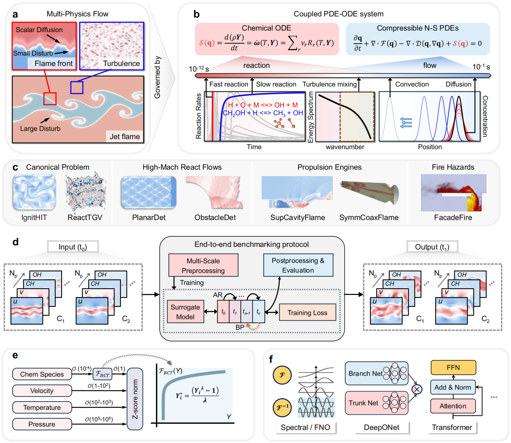
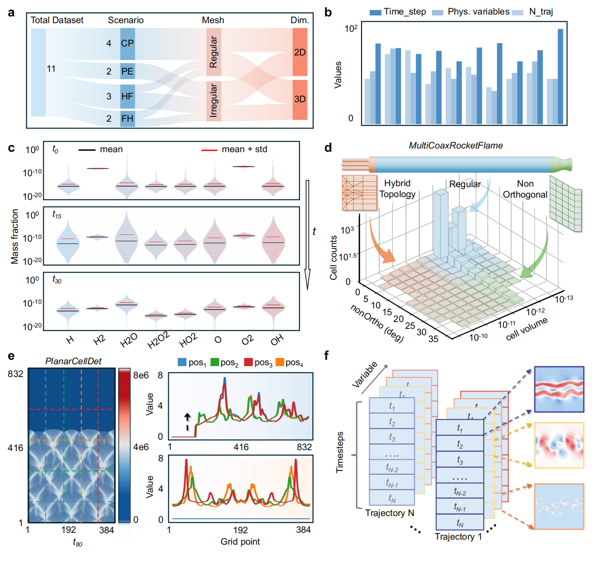
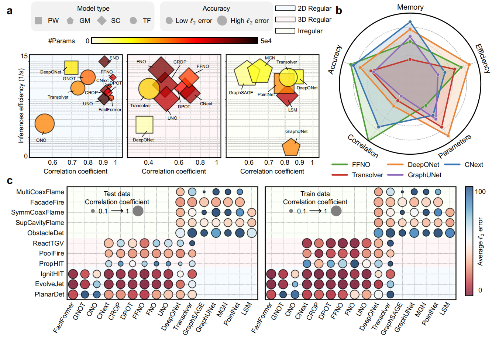
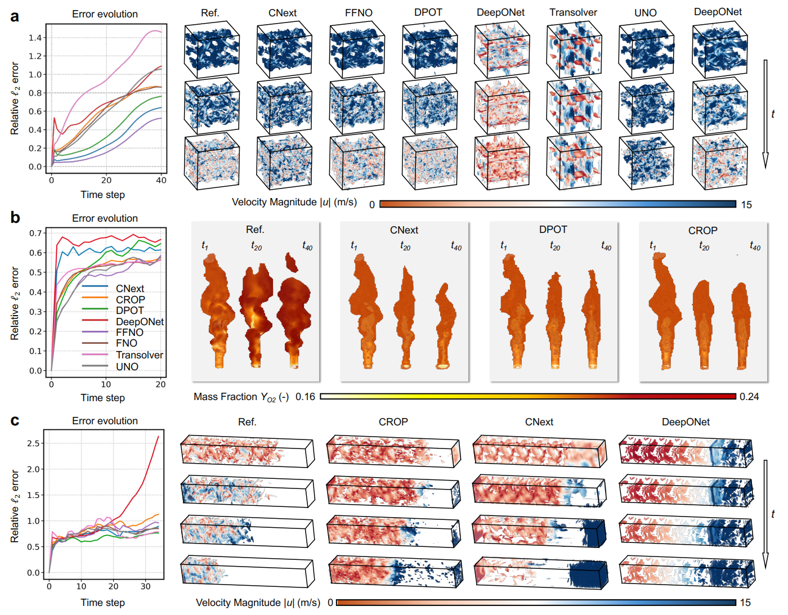
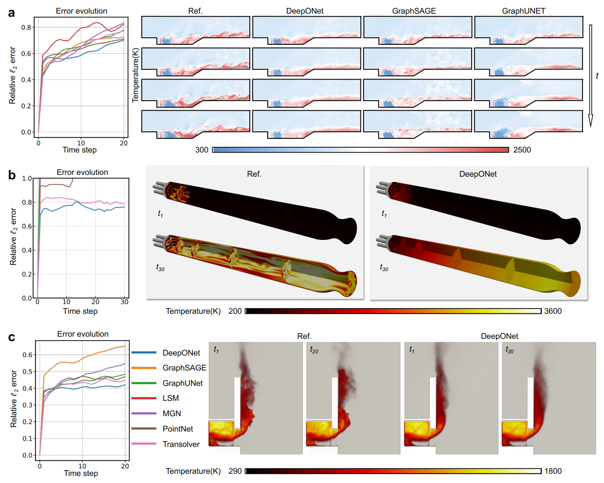

# REALM: Realistic AI Learning for Multiphysics

[](https://arxiv.org/abs/2506.10862) [](https://realm-bench.org/) [](https://claude.ai/chat/LICENSE)

**Benchmarking neural surrogates on realistic spatiotemporal multiphysics flows**

Runze Mao<sup>1,†</sup>, Rui Zhang<sup>2,†</sup>, Xuan Bai<sup>3</sup>, Tianhao Wu<sup>3</sup>, Teng Zhang<sup>3</sup>, Zhenyi Chen<sup>1</sup>, Minqi Lin<sup>1</sup>, Bocheng Zeng<sup>2</sup>, Yangchen Xu<sup>1</sup>, Yingxuan Xiang<sup>1</sup>, Haoze Zhang<sup>1</sup>, Shubham Goswami<sup>4</sup>, Pierre A. Dawe<sup>4</sup>, Yifan Xu<sup>1</sup>, Zhenhua An<sup>5</sup>, Mengtao Yan<sup>2</sup>, Xiaoyi Lu<sup>6</sup>, Yi Wang<sup>6</sup>, Rongbo Bai<sup>7</sup>, Haobu Gao<sup>8</sup>, Xiaohang Fang<sup>4</sup>, Han Li<sup>1,3</sup>, Hao Sun<sup>2,</sup>, Zhi X. Chen<sup>1,3,</sup>

<sup>1</sup>Peking University, <sup>2</sup>Renmin University of China, <sup>3</sup>AI for Science Institute, <sup>4</sup>University of Calgary, <sup>5</sup>Kyoto University, <sup>6</sup>FM Global, <sup>7</sup>LandSpace Technology, <sup>8</sup>Aero Engine Academy of China

<sup>†</sup>Equal contribution, <sup>*</sup>Corresponding authors

------

## 🔥 Overview

<div align="center">    </div>

**REALM** (**RE**alistic **A**I **L**earning for **M**ultiphysics) addresses a critical gap in scientific machine learning: while neural surrogates show promise for accelerating multiphysics simulations, current evaluations rely heavily on simplified benchmarks that fail to expose model limitations in realistic regimes.

### Key Contributions

- **11 High-Fidelity Datasets**: Spanning canonical problems to complex propulsion/fire-safety scenarios
- **Rigorous Protocol**: Standardized preprocessing, training, and evaluation for fair comparison
- **Comprehensive Benchmark**: Systematic evaluation of 12+ representative model families
- **Three Key Findings**:
  1. Scaling barrier governed by dimensionality, stiffness, and mesh irregularity
  2. Performance controlled by architectural inductive biases over parameter count
  3. Persistent gap between nominal accuracy and physically trustworthy behavior

------

## 📊 Dataset Overview

<div align="center">    </div>

### Four Major Categories

| Category                    | Cases                                         | Description                             |
| --------------------------- | --------------------------------------------- | --------------------------------------- |
| **Canonical Problems (CP)** | IgnitHIT, ReactTGV                            | Fundamental multiphysics configurations |
| **High-Mach Flows (HF)**    | PlanarDet, PropHIT                            | Detonation and supersonic combustion    |
| **Propulsion Engines (PE)** | SupCavityFlame, SymmCoaxFlame, MultiCoaxFlame | Scramjet and rocket applications        |
| **Fire Hazards (FH)**       | PoolFire, FacadeFire, EvolveJet               | Building fire safety scenarios          |

### Dataset Statistics

- **Total Size**: ~15 TB
- **Mesh Types**: Regular (2D/3D) and irregular meshes
- **Grid Sizes**: 2×10⁴ to 1.2×10⁷ cells
- **Variables**: 6-40 physical fields per case
- **Trajectories**: Multiple operating conditions per case
- **Time Steps**: 20-50 snapshots per trajectory

------

## 🏗️ Framework Architecture

### Multi-Scale Preprocessing

- **Box-Cox Transformation**: Compress species dynamic range from O(10⁻ᵏ) to O(1)
- **Z-score Normalization**: Standardize all variables consistently
- **Autoregressive Training**: Short-horizon rollout with stable backpropagation

### Supported Model Families

- **Spectral Operators**: FNO, FFNO, CROP, DPOT, UNO, LSM
- **Convolutional Models**: CNext
- **Transformer-Style**: FactFormer, Transolver, ONO, GNOT
- **Pointwise Models**: DeepONet, PointNet
- **Graph/Mesh Networks**: MGN, GraphUNet, GraphSAGE

------

## 📈 Key Results

<div align="center">    </div>

### Performance Trends

**2D Regular Cases**

- FFNO and DPOT achieve slowest error growth
- CNext shows competitive performance with minimal artifacts
- Transformer models limited by memory at high resolutions

**3D Regular Cases**

- All models struggle with fine-scale structure preservation
- FFNO and DPOT maintain best performance
- Faster error accumulation than 2D cases

**Irregular Mesh Cases**

- DeepONet most robust across irregular geometries
- Graph models prone to over-smoothing
- Spectral methods struggle with non-uniform grids

### Representative Visualizations

<div align="center">      <p><i>2D Regular Cases: Error evolution and visual comparisons</i></p> </div> <div align="center">      <p><i>3D Regular Cases: Vorticity and temperature isosurfaces</i></p> </div> <div align="center">      <p><i>Irregular Cases: Temperature field predictions</i></p> </div>

------

## 🚀 Getting Started

### Installation

```bash
git clone https://github.com/deepflame-ai/REALM.git
cd REALM
pip install -r requirements.txt
```

### Data Access

Download datasets from our [website](https://realm-bench.org/) or directly:

```bash
# Download specific case
python scripts/download_data.py --case IgnitHIT

# Download all datasets
python scripts/download_data.py --all
```

### Quick Start

```python
from realm import REALMDataset, REALMTrainer
from realm.models import FFNO

# Load dataset
dataset = REALMDataset(
    case="IgnitHIT",
    split="train",
    preprocessing="standard"
)

# Initialize model
model = FFNO(
    in_channels=12,
    out_channels=12,
    modes=(16, 16),
    width=128
)

# Train
trainer = REALMTrainer(
    model=model,
    dataset=dataset,
    rollout_steps=2,
    max_lr=1e-3
)
trainer.fit()
```

### Evaluation

```bash
# Evaluate trained model
python scripts/evaluate.py \
    --case IgnitHIT \
    --model FFNO \
    --checkpoint path/to/checkpoint.pt \
    --metrics all
```

------

## 📊 Leaderboard

Visit our [live leaderboard](https://realm-bench.org/leaderboard) to view up-to-date model rankings across all cases.

### Top Models by Category

| Category     | Best Model | Test Error | Correlation |
| ------------ | ---------- | ---------- | ----------- |
| 2D Regular   | FFNO       | 1.87       | 0.973       |
| 3D Regular   | FFNO       | 18.45      | 0.896       |
| 2D Irregular | DeepONet   | 29.56      | 0.796       |
| 3D Irregular | DeepONet   | 23.24      | 0.768       |

------

## 📄 Case Descriptions

### Canonical Problems

**IgnitHIT²ᵈ**: Hydrogen ignition kernels in homogeneous isotropic turbulence

- Domain: 50×50 mm², 1024×1024 grid
- Physics: Premixed flame propagation, turbulence-flame interaction
- Trajectories: 36 (varying kernel geometry and turbulence intensity)

**ReactTGV³ᵈ**: Reacting Taylor-Green vortex

- Domain: 2π×2π×2π mm³, 256³ grid
- Physics: Flame-vortex interaction, extinction/reignition
- Trajectories: 16 (varying Reynolds number and mixing length)

### High-Mach Flows

**PlanarDet²ᵈ**: Planar cellular detonation

- Domain: 200×10 mm², 840×400 grid
- Physics: Shock-reaction coupling, cellular structure
- Trajectories: 9 (varying equivalence ratio and temperature)

**PropHIT³ᵈ**: Propagating flame in turbulence

- Domain: 42.4×5.3×5.3 δₗ, 1536×128×128 grid
- Physics: Turbulent premixed combustion at elevated pressure
- Trajectories: 8 (varying pressure and turbulence intensity)

### Propulsion Engines

**SupCavityFlame²ᵈ**: Supersonic cavity flame

- Domain: ~3M irregular cells
- Physics: Scramjet combustion, shock-shear-flame interaction
- Trajectories: 9 (varying injection velocity and location)

**SymmCoaxFlame²ᵈ/MultiCoaxFlame³ᵈ**: Rocket combustors

- Domains: 295K (2D) / 13.5M (3D) irregular cells
- Physics: Shear-coaxial injection, chamber acoustics
- Trajectories: 12 (2D), 6 (3D) varying mixture ratio and thrust

### Fire Hazards

**PoolFire³ᵈ**: Buoyancy-driven pool fire

- Domain: 3×3×3 m³, 80×80×200 grid
- Physics: Plume dynamics, McCaffrey regimes
- Trajectories: 15 (varying heat release rate and pool size)

**FacadeFire³ᵈ**: Building facade fire

- Domain: ~2.5M irregular cells
- Physics: Compartment-facade coupling, external flame spread
- Trajectories: 9 (varying heat release rate)

------

## 🔬 Methodology

### Governing Equations

Multiphysics reactive flows are governed by:

```
∂q/∂t + ∇·F(q) - ∇·D(q,∇q) + S(q) = 0
```

where:

- **q**: Conservative variables [ρ, ρu, ρe, ρY₁, ..., ρYₙ]
- **F**: Convective fluxes
- **D**: Diffusive fluxes
- **S**: Chemical source terms (stiff ODEs)

### Training Protocol

1. **Preprocessing**:
   - Box-Cox transform for species (λ=0.1)
   - Z-score normalization across all fields
2. **Training**:
   - Short-horizon autoregressive rollout
   - Grouped loss by physical variable type
   - OneCycle learning rate schedule
3. **Evaluation**:
   - Full-horizon autoregressive rollout
   - Metrics: MSE, correlation, SSIM, inference time

------

## 📚 Citation

If you use REALM in your research, please cite:

```bibtex
@article{mao2025realm,
  title={Benchmarking neural surrogates on realistic spatiotemporal multiphysics flows},
  author={Mao, Runze and Zhang, Rui and Bai, Xuan and others},
  journal={arXiv preprint arXiv:2506.10862},
  year={2025}
}
```

------

## 🤝 Contributing

We welcome contributions! Please see our [contribution guidelines](https://claude.ai/chat/CONTRIBUTING.md) for details on:

- Adding new models
- Submitting to the leaderboard
- Reporting issues
- Improving documentation

------

## 📧 Contact

- **Hao Sun**: haosun@ruc.edu.cn
- **Zhi X. Chen**: chenzhi@pku.edu.cn
- **Project Website**: [realm-bench.org](https://realm-bench.org/)
- **GitHub Issues**: [github.com/deepflame-ai/REALM/issues](https://github.com/deepflame-ai/REALM/issues)

------

## 📝 License

This project is licensed under the MIT License - see the [LICENSE](https://claude.ai/chat/LICENSE) file for details.

------

## 🙏 Acknowledgments

This work is supported by:

- National Natural Science Foundation of China (92270203, 52441603, 523B2062, 52276096, 62276269, 6250636, 92270118)
- China Postdoctoral Science Foundation (2025M771582)
- Postdoctoral Fellowship Program of CPSF (GZB20250408)

Special thanks to all institutions and collaborators who contributed to dataset generation and validation.

------

## 📊 Related Resources

- **DeepFlame**: [github.com/deepmodeling/deepflame-dev](https://github.com/deepmodeling/deepflame-dev)
- **PDEBench**: [github.com/pdebench/PDEBench](https://github.com/pdebench/PDEBench)
- **Neural Operator Resources**: [neuraloperator.github.io](https://neuraloperator.github.io/)

------

<div align="center">   <i>Bridging the gap between simplified benchmarks and realistic multiphysics challenges</i> </div>
